# Relatório dos Aplicativos

--- 

## Instituição 
Etec Vasco Antônio Venchiarutti

## Curso
Informática para Internet

## Turma
2º ano D

## Autores
- Alice Gimenez Siqueira
- Alice Rasmussen Rezende Alves
- Isabelli Dias da Silva

--- 

# Projeto 1 – Primeiro Aplicativo (pg. 27)

## Descrição 

**Objetivo:** Desenvolver um sistema mobile no App Inventor com o propósito de demonstrar conceitos básicos de programação, utilizando eventos, botões e a manipulação de componentes visuais na interface, permitindo ao usuário compreender de forma simples a interação entre suas ações e as respostas do sistema, bem como o funcionamento da comunicação entre o usuário e a interface do aplicativo.

**Funcionamento:** O aplicativo funciona a partir da interação do usuário com os botões da tela. Quando o usuário clica no botão “Botão1”, o sistema responde exibindo a mensagem “Olá Mundo” na legenda. Já ao clicar no botão “Limpar”, o sistema remove o texto exibido, deixando a legenda em branco. Dessa forma, cada ação do usuário gera uma resposta imediata da interface do aplicativo.

**Mudanças:** Foram realizadas algumas modificações em relação ao modelo apresentado no material, principalmente na personalização da interface. No aplicativo desenvolvido, houve alteração nas cores dos componentes, deixando o visual diferente do padrão apresentado. Também foram feitos ajustes nas propriedades dos elementos, como o tamanho da fonte e a organização dos componentes na tela, proporcionando uma aparência mais adequada. Essas mudanças diferenciam o aplicativo do modelo inicial, tornando a interface mais personalizada e adaptada.

## Print das telas do Design
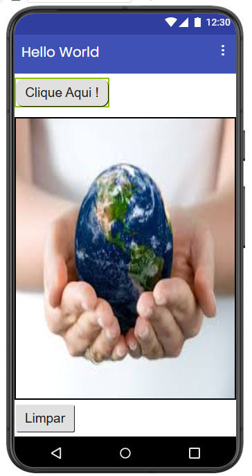

## Print das telas dos Blocos

---

# Projeto 2 – Segundo Aplicativo (pg. 46)

## Descrição

**Objetivo:** Desenvolver um aplicativo que permita ao usuário selecionar diferentes cores e utilizá-las para pintar sobre uma imagem na tela, possibilitando a interação direta com a interface e a manipulação de elementos visuais. O aplicativo também conta com um botão de limpar, responsável por apagar os traços realizados na imagem, permitindo reiniciar a atividade.

**Funcionamento:** O aplicativo funciona a partir da interação do usuário com os botões de cores e a área de desenho. Ao clicar em um dos botões, o sistema altera a cor de pintura, permitindo que o usuário escolha com qual cor deseja desenhar. Em seguida, ao arrastar o dedo sobre a tela, o aplicativo responde desenhando linhas na imagem, acompanhando o movimento realizado.

Além disso, o aplicativo possui um botão de limpar que, ao ser acionado, apaga todos os desenhos feitos, deixando a área novamente em branco. Dessa forma, o funcionamento do aplicativo se baseia nas ações do usuário, que escolhe a cor, desenha na tela e pode reiniciar o desenho quando desejar.

**Mudanças:** Foram feitas mudanças no tamanho da imagem, ajustando altura e largura para “preencher principal”, fazendo com que ela ocupasse melhor a tela. Também houve uma melhora no alinhamento dos elementos, deixando os botões e a imagem mais organizados. Além disso, as cores foram alteradas, deixando o aplicativo mais chamativo e com um visual melhor.

## Print das telas do Design
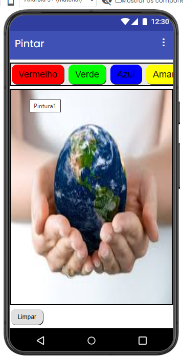

## Print das telas dos Blocos
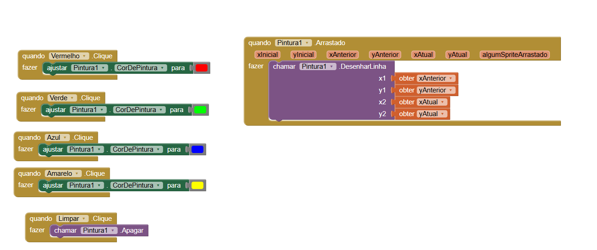

---

# Projeto 3 – Terceiro Aplicativo (pg. 56)

## Descrição

**​Objetivo:** O App "Liquidificador" é uma ferramenta de simulação sensorial desenvolvida em uma plataforma de programação visual por blocos (como o MIT App Inventor). Seu propósito principal é reproduzir a experiência de uso de um aparelho real, utilizando os recursos de áudio e vibração do hardware móvel para criar uma resposta interativa. A interface do aplicativo é projetada de forma visual e direta. No topo, a barra de título identifica o projeto como "Liquidificador".

O corpo central da tela exibe uma ilustração estilizada de um liquidificador nas cores verde e amarelo, que funciona como o ponto focal da interação. Diferente de interfaces complexas, o design utiliza a própria imagem do aparelho como gatilho. O fluxo de uso é imediato: ao tocar na tela, o usuário recebe um feedback bimodal (som e toque), simulando a potência de um motor em funcionamento, o que torna a experiência lúdica e intuitiva.

**Arquitetura Lógica (Programação por Blocos):**
O funcionamento do aplicativo é regido por uma lógica de sincronização que conecta a interface aos atuadores do smartphone:
- Evento de Ativação (Botão1.Clique): Ao detectar o toque no componente visual, o aplicativo dispara simultaneamente duas funções de hardware.
- Emissão Sonora (Som1.Tocar): O aplicativo executa a reprodução de um arquivo de áudio pré-carregado que simula o ruído característico das lâminas e do motor do liquidificador.
- Resposta Tátil (Som1.Vibrar): Para aumentar o realismo, o bloco de vibração é acionado com o parâmetro de 3000 milissegundos. Isso faz com que o aparelho vibre por 3 segundos, imitando a trepidação física de um eletrodoméstico real ligado à tomada.

**Conclusão:** O aplicativo demonstra uma aplicação criativa de como transformar um dispositivo móvel em um simulador de objetos do cotidiano. Ele utiliza com sucesso a integração entre estímulos visuais, auditivos e táteis para criar uma sensação de "causa e efeito" eficiente dentro de um ambiente digital simples.

## Print das telas do Design
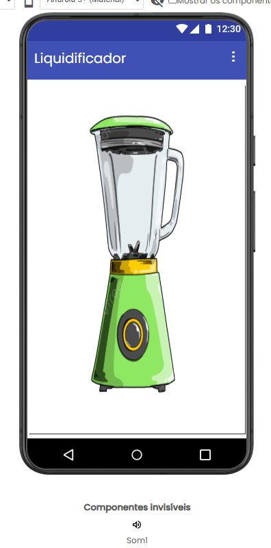

## Print das telas dos Blocos
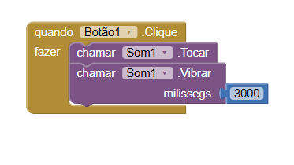

---

# Projeto 4 – Quarto Aplicativo (pg. 64)

## Descrição

​**Objetivo:** O App "Câmera" é uma ferramenta utilitária desenvolvida em uma plataforma de programação visual por blocos (como o MIT App Inventor). Seu propósito principal é oferecer uma interface personalizada para a captura e visualização imediata de fotografias, utilizando os recursos de hardware do dispositivo móvel.

A interface do aplicativo é projetada de forma minimalista para focar na funcionalidade de imagem. No topo, a barra de título identifica o projeto como "Camêra". O corpo central da tela é composto por um componente de exibição (Imagem1). Inicialmente, este espaço aparece vazio, servindo como um "canvas" aguardando o conteúdo. Na base da tela, encontram-se dois botões de comando estrategicamente posicionados: "TirarFoto" e "Fechar". O fluxo de uso é intuitivo: o usuário aciona o comando, tira a foto e a vê aparecer instantaneamente no centro da tela, sem precisar navegar por galerias externas.

**Arquitetura Lógica (Programação por Blocos):** O funcionamento do aplicativo é regido por três eventos principais que conectam os botões às funções do sistema Android:
- Evento de Disparo (Tirar_Foto.Clique): Ao tocar neste botão, o aplicativo executa a função Câmera1.TirarFotografia. Isso faz com que o app saia momentaneamente do primeiro plano para abrir a interface da câmera nativa do celular.
- Evento de Retorno (Câmera1.DepoisDeFotografar): Este é o bloco de inteligência do app. Assim que o usuário confirma a foto tirada, o aplicativo captura o caminho desse arquivo (obter imagem) e atualiza automaticamente a propriedade visual do componente Imagem1. É este bloco que permite que a foto do notebook (ou qualquer outra) apareça preenchendo a tela do app.
- Evento de Navegação (Fechar.Clique): Um comando simples de controle que utiliza o bloco fechar tela para encerrar a atividade atual, garantindo que o usuário possa sair do utilitário de forma direta.

**Conclusão:** O aplicativo demonstra uma aplicação prática e eficiente de integração de hardware (câmera) com interface de software. Ele resolve o problema de visualização rápida, permitindo que registros fotográficos sejam feitos e conferidos dentro de um único ambiente controlado.

## Print das telas do Design
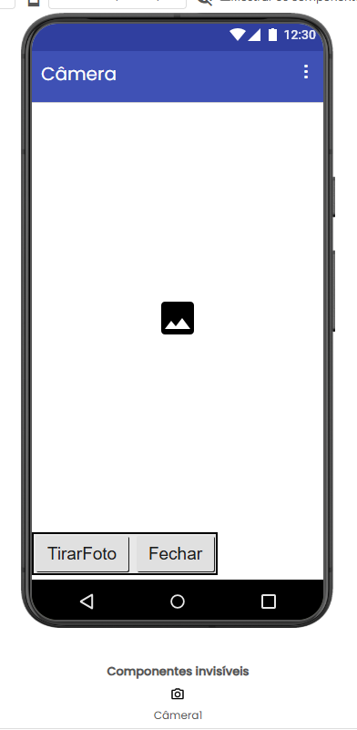

## Print das telas dos Blocos
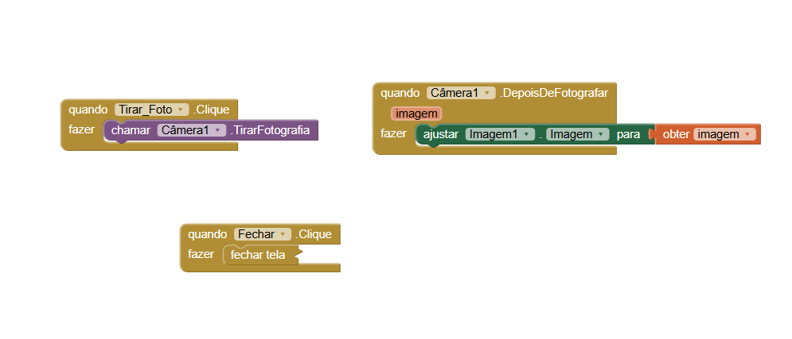

---

# Projeto 5 – Quinto Aplicativo (pg. 69)

## Descrição

**Objetivo:** Usar o App Inventor para desenvolver um aplicativo mobile que permita navegar em duas telas diferentes, utilizando blocos de programação. O sistema permite que o usuário interaja com a interface e acesse telas diferentes, compreendendo como ocorre o funcionamento da troca de telas dentro da aplicação.

**Funcionamento:** O aplicativo funciona a partir da interação do usuário com os botões presentes na tela inicial. Ao clicar em um dos botões, o sistema realiza a ação de abrir uma nova tela. Em cada tela (Screen1 e Screen2) , há botões programados que permitem retornar à tela inicial ou ir para outras telas. Dessa forma, cada clique do usuário gera uma mudança de tela, permitindo a navegação dentro do aplicativo.

**Modificações:** Foram realizadas algumas modificações em relação ao modelo apresentado na apostila, principalmente na personalização da interface. No aplicativo desenvolvido, foram adicionadas imagens de diferentes tartarugas nas telas, deixando o visual diferente do padrão apresentado.

## Print das telas do Design
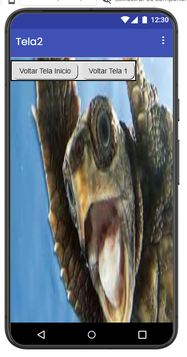

## Print das telas dos Blocos
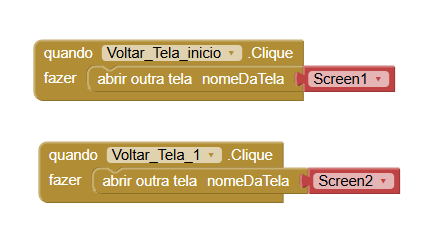

---

# Projeto 6 – Sexto Aplicativo (pg. 82)

## Descrição

**Objetivo:** Usar o App Inventor para desenvolver um aplicativo mobile. Ele demonstra o uso de entrada de dados pelo teclado, utilizando caixa de texto, botão e legenda. O sistema permite que o usuário insira o seu nome e visualize uma mensagem personalizada na tela, compreendendo a interação com componentes de entrada e saída de dados na interface.

**Funcionamento:** O aplicativo funciona a partir da interação do usuário com a caixa de texto e o botão presentes na tela. Ao digitar um nome e clicar no botão, o sistema captura o texto e o combina com uma mensagem definida, mostrando o resultado na legenda. Dessa forma, cada ação do usuário gera uma resposta imediata da interface do aplicativo.

**Modificações:** O aplicativo foi modificado para um tema de vôlei. Foi adicionada uma imagem de uma jogadora de vôlei e, na caixa de texto, o usuário digita seu nome. Ao clicar no botão, a mensagem não mostra só “olá”, mas também adiciona no final “jogadora de vôlei”. Isso deixa o app mais personalizado e diferente do modelo original.

## Print das telas do Design
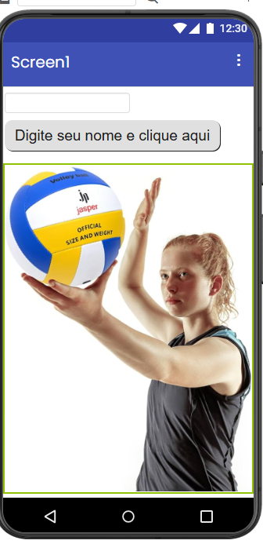

## Print das telas dos Blocos
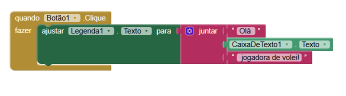