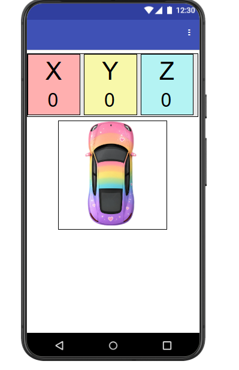
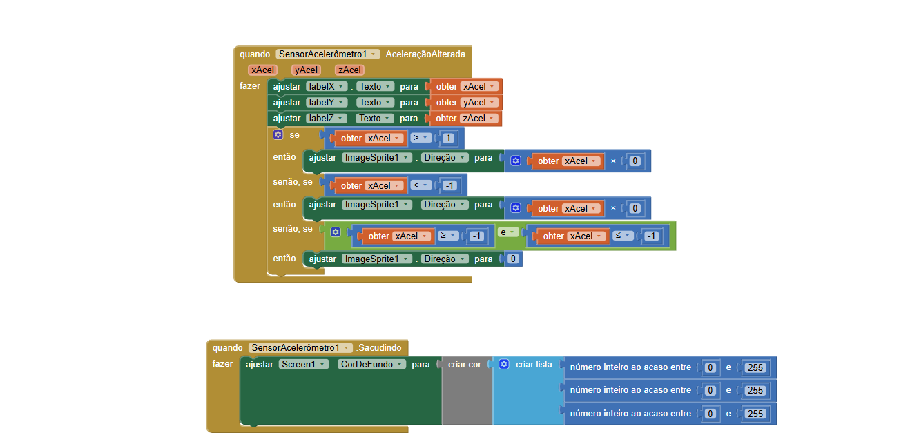
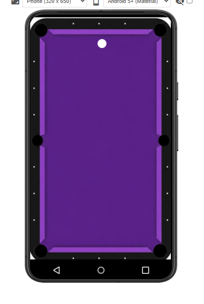
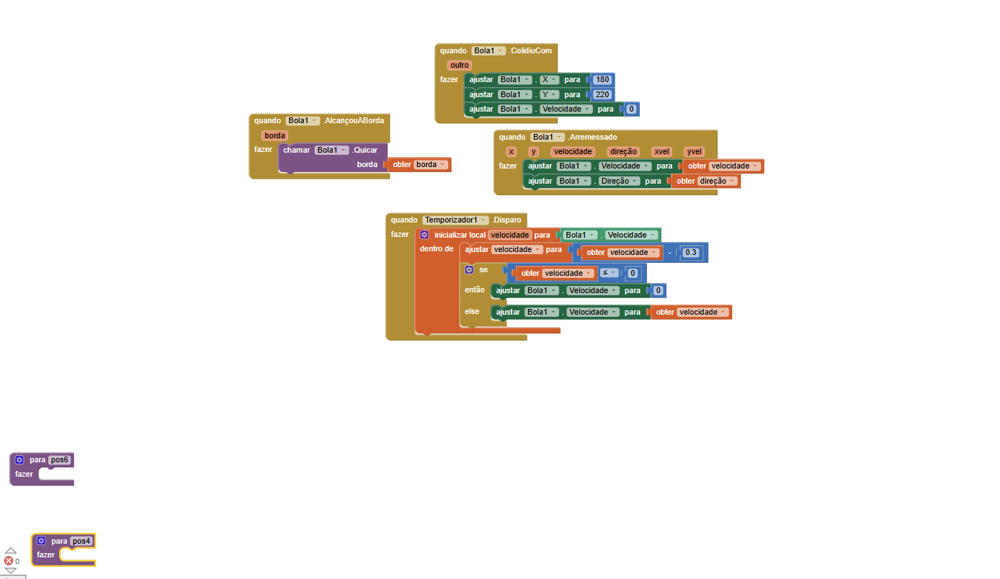

# Relatório dos Aplicativos

--- 

## Instituição 
Etec Vasco Antônio Venchiarutti

## Curso
Informática para Internet

## Turma
2º ano D

## Autores
- Alice Gimenez Siqueira
- Alice Rasmussen Rezende Alves
- Isabelli Dias da Silva

--- 

## Jogo 1
Aplicativo com Acelerômetro

**Introdução**   

Este trabalho foi desenvolvido no App Inventor com o objetivo de aprender sobre o funcionamento do sensor acelerômetro. O aplicativo utiliza a inclinação e os movimentos do celular para movimentar uma imagem na tela, sendo um recurso muito utilizado no desenvolvimento de jogos.

**Objetivo**   

Desenvolver um aplicativo utilizando o sensor acelerômetro para movimentar uma imagem na tela.

**Desenvolvimento**   

O projeto foi criado no App Inventor. O acelerômetro foi utilizado para detectar a inclinação do celular e movimentar a imagem do carrinho.

**Mudança realizada**   

A principal alteração no projeto foi a imagem do carro. O carro original foi substituído por um carro colorido, deixando o aplicativo mais personalizado.

**Conclusão**   

Com o desenvolvimento do aplicativo, foi possível entender melhor o funcionamento do sensor acelerômetro e sua utilização para criar movimentos em jogos no App Inventor.

## Print das telas do Design

## Print das telas dos Blocos

## Jogo 2
Aplicativo com Bilhar

**Introdução**

Neste projeto, criamos um aplicativo de bilhar no MIT App Inventor, utilizando uma bola, uma mesa e caçapas para simular um jogo simples de sinuca.

**Objetivo**

O objetivo foi criar um aplicativo interativo, no qual o usuário pudesse movimentar a bola pela mesa e observar suas colisões e movimentos.

**Desenvolvimento**

Durante o desenvolvimento, programamos a bola para rebater nas bordas usando o evento EdgeReached. Também utilizamos o Clock para diminuir a velocidade da bola até ela parar. Adicionamos as seis caçapas e programamos a colisão entre a bola e elas. O movimento da bola é controlado pelo usuário através do evento Flung.

**Mudança realizada**

A mudança realizada foi a alteração da cor da mesa de sinuca, deixando o aplicativo com uma aparência diferente.

**Conclusão**

Conseguimos criar um jogo simples de bilhar com movimento, colisão, rebote e desaceleração da bola.

## Print das telas do Design

## Print das telas dos Blocos

## Jogo 3
Aplicativo com PongMaster

**Introdução**   

O Pong Star é um jogo desenvolvido para Android utilizando o MIT App Inventor. O aplicativo é inspirado no clássico Pong, no qual o jogador controla uma barra para rebater uma bola e destruir blocos.

**Objetivo**   

O objetivo é conseguir a maior pontuação possível, rebatendo a bola e evitando que ela ultrapasse a parte inferior da tela. O aplicativo possui opções de nível médio e difícil.

**Desenvolvimento**   

O aplicativo foi desenvolvido por meio de programação em blocos, utilizando componentes como Canvas, ImageSprite, Buttons, Labels e Sound. Foram criadas diferentes telas para o menu, seleção de nível e partida.

**Funcionamento**   

Durante o jogo, o jogador movimenta a barra para a direita e para a esquerda. A bola se movimenta pela tela e, ao atingir um bloco, ele desaparece e a pontuação aumenta. As colisões também alteram a direção da bola e podem reproduzir efeitos sonoros.

**Pontuação e fim de jogo**   

A pontuação começa em zero e aumenta a cada bloco destruído. Quando a bola atinge a parte inferior da tela, a partida termina e é apresentada a tela de Game Over.

**Conclusão**   

O desenvolvimento do Pong Star permitiu aplicar conceitos de lógica de programação, eventos, variáveis, colisões e movimentação de objetos. O resultado é um jogo simples, interativo e funcional, desenvolvido através do MIT App Inventor.
