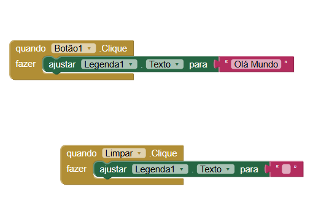

# Relatório dos Aplicativos

--- 

## Instituição 
Etec Vasco Antônio Venchiarutti

## Curso
Informática para Internet

## Turma
2º ano D

## Autores
- Alice Gimenez Siqueira
- Alice Rasmussen Rezende Alves
- Isabelli Dias da Silva

--- 

# Projeto 1 – Primeiro Aplicativo (pg. 27)

## Descrição 

**Objetivo:** Desenvolver um sistema mobile no App Inventor com o propósito de demonstrar conceitos básicos de programação, utilizando eventos, botões e a manipulação de componentes visuais na interface, permitindo ao usuário compreender de forma simples a interação entre suas ações e as respostas do sistema, bem como o funcionamento da comunicação entre o usuário e a interface do aplicativo.

**Funcionamento:** O aplicativo funciona a partir da interação do usuário com os botões da tela. Quando o usuário clica no botão “Botão1”, o sistema responde exibindo a mensagem “Olá Mundo” na legenda. Já ao clicar no botão “Limpar”, o sistema remove o texto exibido, deixando a legenda em branco. Dessa forma, cada ação do usuário gera uma resposta imediata da interface do aplicativo.

**Mudanças:** Foram realizadas algumas modificações em relação ao modelo apresentado no material, principalmente na personalização da interface. No aplicativo desenvolvido, houve alteração nas cores dos componentes, deixando o visual diferente do padrão apresentado. Também foram feitos ajustes nas propriedades dos elementos, como o tamanho da fonte e a organização dos componentes na tela, proporcionando uma aparência mais adequada. Essas mudanças diferenciam o aplicativo do modelo inicial, tornando a interface mais personalizada e adaptada.

## Print das telas do Design

## Print das telas dos Blocos

---

# Projeto 2 – Segundo Aplicativo (pg. 46)

## Descrição

**Objetivo:** Desenvolver um aplicativo que permita ao usuário selecionar diferentes cores e utilizá-las para pintar sobre uma imagem na tela, possibilitando a interação direta com a interface e a manipulação de elementos visuais. O aplicativo também conta com um botão de limpar, responsável por apagar os traços realizados na imagem, permitindo reiniciar a atividade.

**Funcionamento:** O aplicativo funciona a partir da interação do usuário com os botões de cores e a área de desenho. Ao clicar em um dos botões, o sistema altera a cor de pintura, permitindo que o usuário escolha com qual cor deseja desenhar. Em seguida, ao arrastar o dedo sobre a tela, o aplicativo responde desenhando linhas na imagem, acompanhando o movimento realizado.

Além disso, o aplicativo possui um botão de limpar que, ao ser acionado, apaga todos os desenhos feitos, deixando a área novamente em branco. Dessa forma, o funcionamento do aplicativo se baseia nas ações do usuário, que escolhe a cor, desenha na tela e pode reiniciar o desenho quando desejar.

**Mudanças:** Foram feitas mudanças no tamanho da imagem, ajustando altura e largura para “preencher principal”, fazendo com que ela ocupasse melhor a tela. Também houve uma melhora no alinhamento dos elementos, deixando os botões e a imagem mais organizados. Além disso, as cores foram alteradas, deixando o aplicativo mais chamativo e com um visual melhor.

## Print das telas do Design