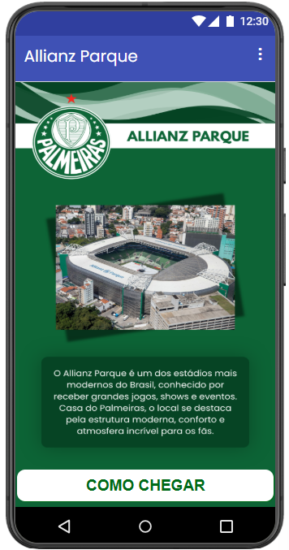
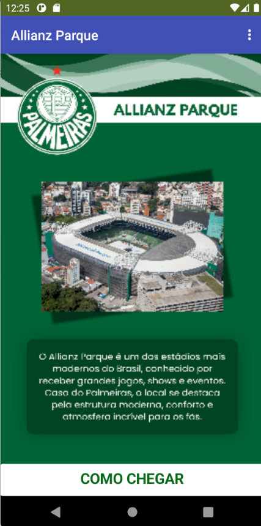
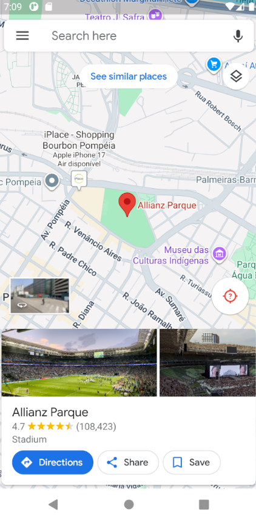
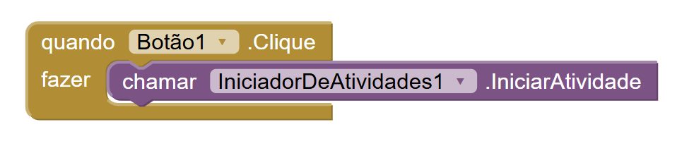

# Relatório dos Aplicativos

**`Instituição:`**
ETEC Vasco Antônio Venchiarutti

**`Curso:`**
Informática para Internet

**`Turma:`**
2º ano D

**`Autores:`**
- [Amanda Neves Oliveira](https://github.com/amandanevoli)
- [Ana Lívia Takeyama Romanato](https://github.com/liviatakeyama)

---

# Projeto 1 - Abrindo links web (Componentes Avançados - 1)

## Descrição
**Objetivo:**   
O objetivo deste aplicativo foi aprender a utilizar o componente `ActivityStarter` no App Inventor para realizar o redirecionamento do usuário para páginas da web externas. Além disso, o projeto teve como finalidade compreender o funcionamento de links externos dentro de aplicativos mobile e praticar a criação de interfaces simples.

**Funcionamento:**   
O aplicativo apresenta uma interface contendo imagem, texto informativo e um botão chamado “Abrir link Web”. Ao clicar no botão, o componente `ActivityStarter` é acionado utilizando a ação `android.intent.action.VIEW`, responsável por abrir conteúdos externos no navegador do dispositivo. Dessa forma, o usuário é redirecionado automaticamente para o site configurado na propriedade `DataUri`.

**Modificações feitas diante da apostila:**   
Foram realizadas algumas modificações em relação ao modelo apresentado na apostila. A interface foi personalizada com a adição de uma imagem ilustrativa, textos informativos sobre o vestibulinho e alterações visuais no botão, como mudança de cor e tamanho. Também foi utilizado um link diferente do exemplo original da apostila, adaptando o aplicativo para um contexto mais visual e informativo.

| Print da Tela do Design (Navegador) | Print da Tela do Design (Emulador) | Print da Tela Redirecionada | Print da Tela dos Blocos |
| ---- | ---- | ---- | ---- |
|  |  |  |  |

---

# Projeto 2 - Envio de correios eletrônicos (Componentes Avançados - 1)

## Descrição
**Objetivo:**   

**Funcionamento:**   

**Modificações feitas diante da apostila:**   

| Print da Tela do Design (Navegador) | Print da Tela do Design (Emulador) | Print da Tela Redirecionada | Print da Tela dos Blocos |
| ---- | ---- | ---- | ---- |
|  |  |  |  |

--- 

# Projeto 3 - Uso de mapas (Componentes Avançados - 2)

## Descrição
**Objetivo:**   
O objetivo deste aplicativo foi aprender a utilizar o componente `ActivityStarter` para abrir mapas e realizar a localização de lugares específicos utilizando o Google Maps. O projeto também teve como finalidade compreender o funcionamento de coordenadas geográficas e da integração de aplicativos externos dentro do App Inventor.

**Funcionamento:**   
O aplicativo apresenta informações sobre o estádio Allianz Parque, contendo imagem, texto descritivo e um botão para visualização da localização. Ao clicar no botão, o componente `ActivityStarter` é acionado utilizando a ação `android.intent.action.VIEW` juntamente com coordenadas geográficas configuradas na propriedade `DataUri`. Assim, o aplicativo abre automaticamente o Google Maps, centralizando o mapa na localização definida e exibindo uma marcação no local.

**Modificações feitas diante da apostila:**   
Foram realizadas diversas modificações em relação ao exemplo apresentado na apostila. Em vez de utilizar as coordenadas da cidade de São Paulo de forma genérica, foi escolhida a localização do estádio Allianz Parque. Também foram adicionados elementos visuais personalizados, como imagem do estádio, logotipo do Palmeiras, cores temáticas em verde e textos informativos sobre o local. Além disso, o botão recebeu uma personalização visual para deixar a interface mais organizada e atrativa.

| Print da Tela do Design (Navegador) | Print da Tela do Design (Emulador) | Print da Tela Redirecionada | Print da Tela dos Blocos |
| ---- | ---- | ---- | ---- |
|  |  |  |  |

