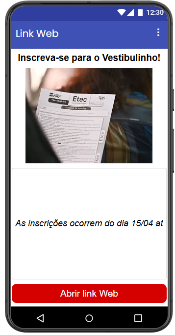
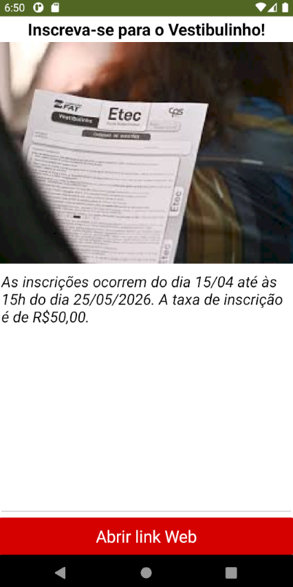

# Relatório dos Aplicativos

**`Instituição:`**
ETEC Vasco Antônio Venchiarutti

**`Curso:`**
Informática para Internet

**`Turma:`**
2º ano D

**`Autores:`**
- [Amanda Neves Oliveira](https://github.com/amandanevoli)
- [Ana Lívia Takeyama Romanato](https://github.com/liviatakeyama)

---

# Componentes Avançados - 1

---

# Projeto 1 - Abrindo links web

## Descrição
**Objetivo:**   

**Funcionamento:**   

**Modificações feitas diante da apostila:**   

| Print da Tela do Design (Navegador) | Print da Tela do Design (Emulador) | Print da Tela dos Blocos |
| ---- | ---- | ---- |
|  |  |  |

---

