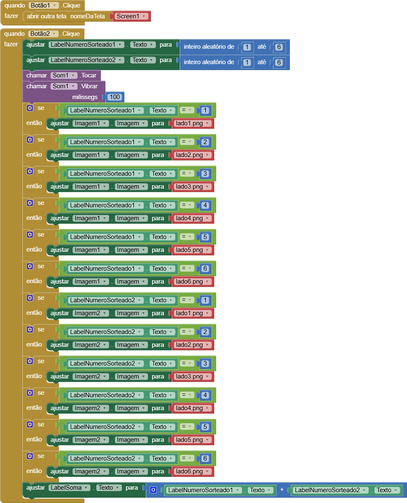

# Relatório dos Jogos

**`Instituição:`**
ETEC Vasco Antônio Venchiarutti

**`Curso:`**
Informática para Internet

**`Turma:`**
2º ano D

**`Autores:`**
- [Amanda Neves Oliveira](https://github.com/amandanevoli)
- [Ana Lívia Takeyama Romanato](https://github.com/liviatakeyama)

---

# Jogo 1 - Dado Mágico

## Descrição

**Objetivo:**   
O objetivo deste aplicativo foi desenvolver um simulador digital de dados utilizando o MIT App Inventor, com foco no aprendizado de lógica de programação para dispositivos móveis. O projeto permitiu trabalhar a geração de números aleatórios, o uso de estruturas condicionais para alterar imagens dinamicamente, a integração de recursos multimídia (som e vibração) e a criação de interfaces com múltiplas telas e navegação entre elas.

**Funcionamento:**   
O aplicativo é composto por duas telas de design integradas. Ao interagir com o botão *"Sortear"*, o sistema gera simultaneamente dois números inteiros aleatórios no intervalo de 1 a 6, armazenando-os em rótulos de texto. No mesmo instante, os componentes de multimídia são acionados, reproduzindo um efeito sonoro e fazendo o aparelho vibrar por 100 milissegundos.

Na sequência, uma estrutura de blocos condicionais verifica o valor gerado para cada dado e altera dinamicamente a propriedade da imagem correspondente para exibir a face correta do dado. Por fim, ao clicar no botão que redireciona o usuário para a segunda tela do aplicativo, presente no topo da tela, ao clicar no botão *"Sortear"*, é realizado a operação matemática de soma entre os dois valores sorteados e exibido o resultado. O usuário também pode utilizar o botão superior, na mesma página, para navegar de volta à tela inicial, garantindo a fluidez e a usabilidade do aplicativo.

**Modificações feitas diante do vídeo:**   
Foram realizadas algumas modificações em relação ao modelo original apresentado em vídeo. A interface foi personalizada com a identidade visual do projeto, incluindo a adição de novas imagens e alterações estéticas no botão, como a mudança de cor e ajuste de tamanho para melhorar a usabilidade.

Também foi implementado um recurso avançado aprendido em aulas anteriores: a inserção de uma nova tela para segmentar as funções do aplicativo. Nessa tela secundária (acessada através do botão localizado no topo da tela principal), o usuário visualiza dois dados simultaneamente. Ao clicar no botão inferior *("Sortear")*, o aplicativo gera dois números inteiros aleatórios no intervalo de 1 a 6, altera as imagens correspondentes em tempo real e realiza a soma automática dos valores, exibindo o resultado logo abaixo para o usuário. Já na tela principal, é exibido apenas um dado por vez. 

| Print da 1ª Tela do Design | Print da 2ª Tela do Design | Print da Tela dos Blocos |
| ---- | ---- | ---- |
|  |  |  |

--- 

# Jogo 2 - Adivinhe o Número

## Descrição

**Objetivo:**   
O objetivo deste aplicativo foi desenvolver um jogo interativo de desafio matemático utilizando o MIT App Inventor. O projeto teve como finalidade prática aprofundar os conhecimentos em lógica de programação mobile, focando na criação e manipulação de variáveis globais, geração de valores aleatórios de grande escala, e no uso de estruturas condicionais aninhadas (`se... então... senão`) para gerenciar diferentes operações matemáticas (adição, subtração e multiplicação). Além disso, buscou-se trabalhar com o armazenamento e atualização em tempo real de pontuações (placar de acertos e erros) e a integração de notificações para o usuário.

**Funcionamento:**   
O aplicativo funciona como um quiz de matemática dinâmico. Assim que a tela inicial é carregada, o procedimento de sorteio de uma nova conta é acionado automaticamente, gerando dois números inteiros aleatórios na casa dos milhares, entre 1 e 9999, e escolhendo aleatoriamente um operador matemático de 1 a 3. Caso o operador escolhido seja o número 1, o sistema realiza uma operação de adição entre os valores. Se for o número 2, é executada uma subtração, contando com uma lógica interna que compara os números para garantir que o menor seja subtraído do maior, evitando resultados negativos. Caso o operador seja o número 3, o sistema realiza uma multiplicação. 

O usuário deve calcular o valor e digitar sua resposta no campo de texto. Ao clicar no botão de verificar resultado, o sistema valida a resposta fornecida. Se o cálculo estiver correto, o placar de acertos soma mais um ponto, um som de acerto é reproduzido e um alerta textual parabeniza o usuário. Se a resposta estiver errada, o placar de erros é incrementado, um som de erro toca, o dispositivo vibra e uma notificação revela qual era a resposta correta. 

Em ambos os casos, após a verificação, o campo de texto é limpo e uma nova conta aleatória é gerada automaticamente, sendo que o usuário também pode utilizar o botão de sair para fechar a aplicação imediatamente.

**Modificações feitas diante do vídeo:**   
Foram realizadas alterações significativas em relação ao modelo original demonstrado em vídeo, visando a personalização e o aumento do desafio do jogo. A interface visual foi reestruturada através da alteração da paleta de cores, adotando tons de roxo, além da modificação no tamanho e fontes dos textos e da reorganização dos componentes visuais para tornar o aplicativo mais moderno e intuitivo.

Outra grande mudança ocorreu no aumento da complexidade matemática e da ordem de grandeza, visto que no projeto original do vídeo o sistema operava com números menores na casa das centenas, exibindo apenas três dígitos. Como modificação, a lógica dos blocos foi alterada para sortear números inteiros aleatórios de 1 a 9999, atualizando os campos de exibição para a casa dos milhares e elevando consideravelmente o nível de dificuldade dos cálculos.

Por fim, foi implementada uma melhoria na lógica do componente de notificação para o alerta de erro. Diferente do modelo base, que apenas notificava o erro em si, foi utilizado o bloco de texto para juntar informações, permitindo que o aplicativo agora exiba dinamicamente o valor correto da operação matemática junto com a mensagem de erro, garantindo que o usuário saiba imediatamente qual era o resultado exato e tornando o aplicativo muito mais didático.

| Print da Tela do Design | Print da Tela dos Blocos |
| ---- | ---- |
|  |  |

--- 

