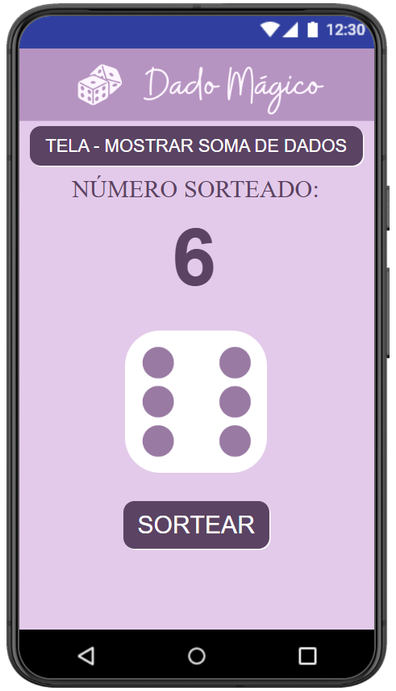
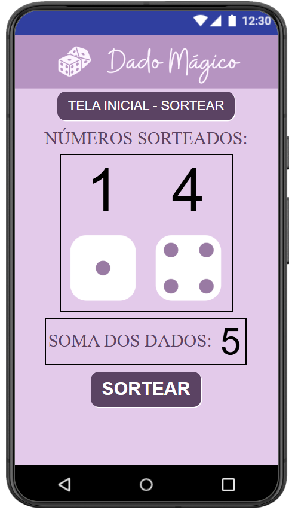
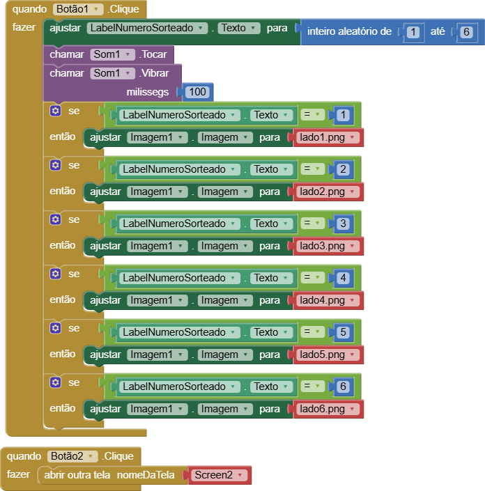
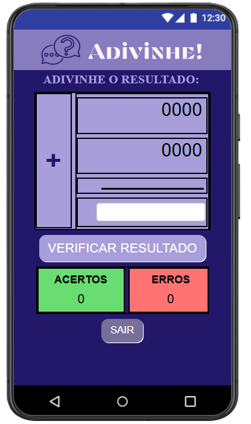
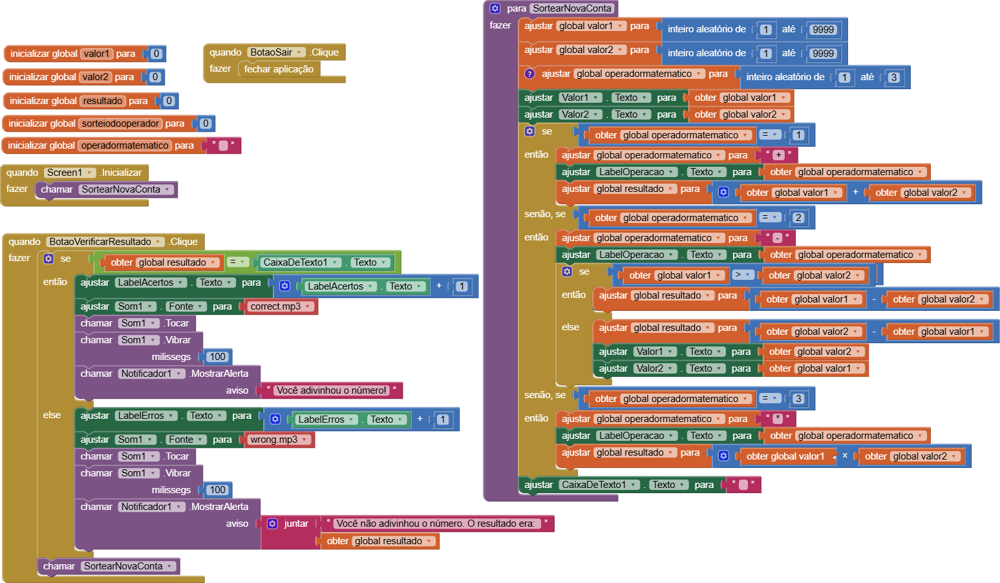

# Relatório dos Jogos

**`Instituição:`**
ETEC Vasco Antônio Venchiarutti

**`Curso:`**
Informática para Internet

**`Turma:`**
2º ano D

**`Autores:`**
- [Amanda Neves Oliveira](https://github.com/amandanevoli)
- [Ana Lívia Takeyama Romanato](https://github.com/liviatakeyama)

---

# Jogo 1 - Dado Mágico

## Descrição

**Objetivo:**   

O objetivo deste aplicativo foi desenvolver um simulador digital de dados utilizando o MIT App Inventor, com foco no aprendizado de lógica de programação para dispositivos móveis. O projeto permitiu trabalhar a geração de números aleatórios, o uso de estruturas condicionais para alterar imagens dinamicamente, a integração de recursos multimídia (som e vibração) e a criação de interfaces com múltiplas telas e navegação entre elas.

**Funcionamento:**   

O aplicativo possui duas telas integradas. Ao clicar no botão *"Sortear"*, o sistema gera números aleatórios de 1 a 6, reproduz um efeito sonoro e faz o aparelho vibrar por 100 milissegundos. Em seguida, estruturas condicionais verificam os valores gerados e alteram as imagens para exibir a face correta dos dados.

Na segunda tela, acessada por um botão localizado no topo da tela principal, são exibidos dois dados simultaneamente. Ao realizar um novo sorteio, o aplicativo gera dois números aleatórios, atualiza as imagens correspondentes e calcula automaticamente a soma dos valores, exibindo o resultado ao usuário. Também há um botão para retornar à tela inicial, garantindo uma navegação simples e intuitiva.

**Modificações feitas diante do vídeo:**   

Foram realizadas personalizações na interface, incluindo novas imagens, alterações de cores e ajustes no tamanho dos botões para melhorar a aparência e a usabilidade do aplicativo.

Além disso, foi implementada uma segunda tela, recurso não presente no modelo original. Nela, o usuário pode visualizar dois dados ao mesmo tempo e acompanhar o resultado da soma dos valores sorteados. Já na tela principal, é exibido apenas um dado por vez, tornando as funcionalidades mais organizadas.

| Print da 1ª Tela do Design | Print da 2ª Tela do Design | Print da Tela dos Blocos da 1ª Tela | Print da Tela dos Blocos da 2ª  Tela |
| ---- | ---- | ---- | ---- |
|  |  |  |  |

--- 

# Jogo 2 - Adivinhe o Número

## Descrição

**Objetivo:**   

O objetivo deste aplicativo foi desenvolver um jogo interativo de desafio matemático utilizando o MIT App Inventor, com foco no aprendizado de lógica de programação para dispositivos móveis. O projeto permitiu trabalhar a criação e manipulação de variáveis globais, a geração de números aleatórios, o uso de estruturas condicionais para diferentes operações matemáticas (adição, subtração e multiplicação), além do controle de pontuação e da utilização de notificações e sons.

**Funcionamento:**   

O aplicativo funciona como um quiz de matemática. Ao iniciar, o sistema gera automaticamente dois números aleatórios entre 1 e 9999 e sorteia uma operação matemática. Dependendo do operador sorteado, é realizada uma adição, subtração ou multiplicação. No caso da subtração, o aplicativo garante que o maior número seja subtraído pelo menor, evitando resultados negativos.

O usuário deve calcular o resultado e digitá-lo no campo de resposta. Ao clicar no botão de verificação, o sistema compara o valor informado com o resultado correto. Em caso de acerto, o placar de acertos é atualizado, um som é reproduzido e uma mensagem de aviso é exibida. Em caso de erro, o placar de erros é incrementado, um som de erro é tocado, o dispositivo vibra e uma notificação informa a resposta correta. Após cada tentativa, o campo é limpo e uma nova conta é gerada automaticamente. O aplicativo também possui um botão para encerramento imediato.

**Modificações feitas diante do vídeo:**   

Foram realizadas diversas alterações para personalizar e tornar o jogo mais desafiador. A interface recebeu uma nova identidade visual, com mudanças na paleta de cores, nos tamanhos e estilos dos textos e na organização dos componentes. Também foi aumentada a dificuldade das operações matemáticas. Enquanto o modelo original utilizava números menores, na casa das centenas, este projeto passou a trabalhar com valores entre 1 e 9999, exigindo cálculos mais complexos.

Além disso, a lógica da notificação de erro foi aprimorada. Em vez de apenas informar que a resposta estava incorreta, o aplicativo passou a exibir também o resultado correto da operação, tornando a experiência mais educativa e auxiliando no aprendizado do usuário.

| Print da Tela do Design | Print da Tela dos Blocos |
| ---- | ---- |
|  |  |

--- 

