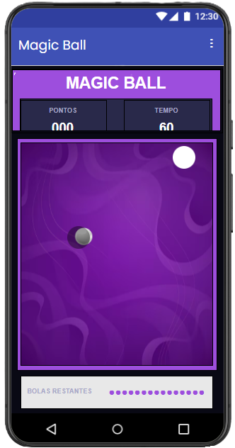
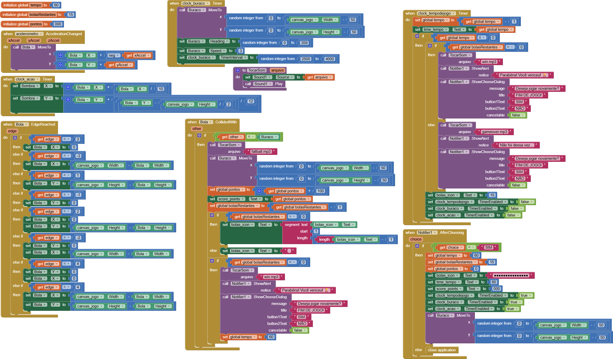

# Relatório dos Jogos

**`Instituição:`**
ETEC Vasco Antônio Venchiarutti

**`Curso:`**
Informática para Internet

**`Turma:`**
2º ano D

**`Autores:`**
- [Amanda Neves Oliveira](https://github.com/amandanevoli)
- [Ana Lívia Takeyama Romanato](https://github.com/liviatakeyama)

---

# Jogo 1 - Magic Ball

## Descrição

**Objetivo:**   

O objetivo do projeto é criar um jogo no MIT App Inventor utilizando o acelerômetro do celular para controlar uma bola. O jogador deve inclinar o aparelho para movimentar a bola e tentar acertar o buraco, acumulando pontos e diminuindo a quantidade de bolas restantes. O jogo também possui um limite de tempo, tornando a partida mais desafiadora.

**Funcionamento:**   

A bola é movimentada pelo acelerômetro através dos eixos X e Y, de acordo com a inclinação do celular. Ela possui uma sombra para deixar o movimento mais parecido com uma mesa. Também foi programado um sistema para que a bola, ao atingir uma borda, apareça do outro lado do Canvas. O buraco muda de posição durante o jogo e, quando a bola colide com ele, ocorre o registro do acerto e a atualização das bolas restantes

**Modificações feitas:**   

A partir do material fornecido, foram feitas modificações principalmente no design e na organização do jogo. Foram utilizadas novas imagens, cores e uma organização diferente dos componentes da tela. Também foram realizados ajustes nos blocos para controlar a pontuação, as bolas restantes, o tempo e a velocidade do buraco. Essas alterações foram feitas para deixar o jogo mais personalizado e melhorar sua jogabilidade, mantendo a ideia principal apresentada no material.

| Print da Tela do Design | Print da Tela dos Blocos |
| ---- | ---- |
|  |  |