# Relatório dos Aplicativos

**`Instituição:`**
ETEC Vasco Antônio Venchiarutti

**`Curso:`**
Informática para Internet

**`Turma:`**
2º ano D

**`Autores:`**
- [Amanda Neves Oliveira](https://github.com/amandanevoli)
- [Ana Lívia Takeyama Romanato](https://github.com/liviatakeyama)

---

# Projeto 1 – Primeiro Aplicativo (pg. 27)

## Descrição
**Objetivo:**   
 O aplicativo tem como objetivo demonstrar, de forma simples e prática, como ocorre a interação entre o usuário e a interface de um sistema mobile. Ele foi desenvolvido para exemplificar conceitos básicos de programação, como o uso de eventos, botões e a manipulação de componentes visuais na tela. Além disso, busca facilitar o entendimento de iniciantes sobre como ações do usuário podem gerar respostas imediatas no aplicativo, tornando o aprendizado mais visual e intuitivo.

**Funcionamento:**   
O funcionamento do aplicativo é baseado em eventos de clique nos botões presentes na tela. Ao clicar no botão “Clique aqui!”, o sistema executa uma ação que exibe o texto de uma legenda, exibindo a mensagem “Olá, mundo” para o usuário. Quando o botão “Limpar” é pressionado, o aplicativo remove o conteúdo exibido anteriormente. Já o botão “Fechar” tem a função de encerrar o aplicativo imediatamente. Dessa forma, o app responde diretamente às ações do usuário, demonstrando na prática como funciona a lógica de programação orientada a eventos em aplicativos móveis.

**Modificações feitas diante da apostila:**   
Com base no exemplo apresentado na apostila, foram realizadas algumas melhorias na interface do aplicativo com o objetivo de torná-la mais organizada e moderna. Entre as alterações feitas, destaca-se a substituição da imagem original por outra mais adequada à proposta do aplicativo, contribuindo para uma melhor apresentação visual. Além disso, houve o aumento do tamanho da fonte, facilitando a leitura e proporcionando maior acessibilidade ao usuário. Também foram modificadas as cores dos botões, deixando-os mais harmônicos e atrativos, o que melhora a experiência de navegação e interação dentro do aplicativo.

| Print da tela do Design | Print da tela dos Blocos |
|----|---|
| 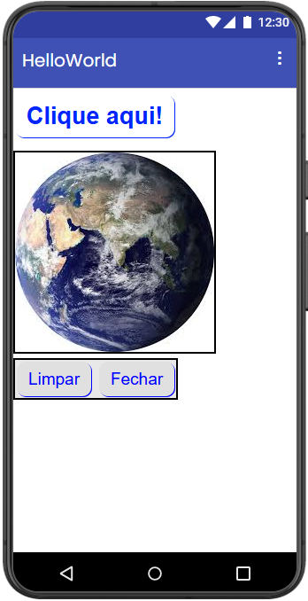 | 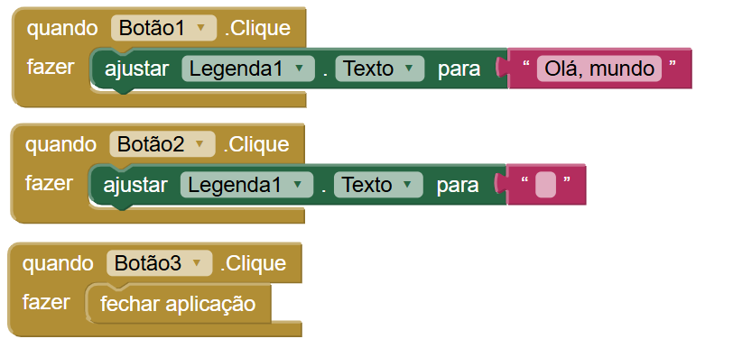 |

---

# Projeto 2 – Segundo Aplicativo (pg. 46)

## Descrição
**Objetivo:**   
O aplicativo tem como objetivo proporcionar uma experiência interativa de desenho para o usuário, permitindo que ele explore sua criatividade por meio da pintura digital. Desenvolvido com foco no aprendizado, o app demonstra na prática conceitos importantes da programação, como o uso de eventos de toque, manipulação de cores e interação com componentes gráficos. Além disso, busca tornar a experiência mais dinâmica e intuitiva, oferecendo uma interface simples e de fácil utilização.

**Funcionamento:**   
O funcionamento do aplicativo baseia-se na interação do usuário com os botões de cores e a área de desenho. Ao selecionar uma das opções disponíveis — rosa, verde, azul ou laranja — a cor do pincel é alterada conforme a escolha. Em seguida, ao arrastar o dedo sobre a área de pintura, o aplicativo registra o movimento e desenha linhas contínuas na tela, criando o efeito de desenho livre. Caso o usuário deseje recomeçar, o botão “Limpar” permite apagar todo o conteúdo desenhado, deixando a área pronta para uma nova criação. Dessa forma, o aplicativo responde em tempo real aos comandos do usuário, demonstrando de maneira prática o funcionamento de eventos e interações em aplicações mobile.

**Modificações feitas diante da apostila:**   
Com base no modelo apresentado na apostila, foram realizadas algumas modificações na interface do aplicativo com o objetivo de torná-la mais personalizada e visualmente mais atrativa. As cores originais foram substituídas pelas cores rosa, verde, azul e laranja, conforme exibido na interface, o que também resultou na alteração das cores dos botões para manter uma harmonia visual com as opções de pintura. Além disso, uma nova imagem foi inserida no lugar da anterior, contribuindo para uma aparência mais adequada ao contexto do aplicativo. O botão “Limpar” também passou por ajustes em suas dimensões, tendo sua altura e largura ampliadas para melhor aproveitamento do espaço na tela, proporcionando maior destaque e facilidade de uso. Por fim, a cor da área do botão foi modificada, tornando-o mais visível e alinhado ao restante do design do aplicativo.

| Print da tela do Design | Print da tela dos Blocos |
|----|---|
| 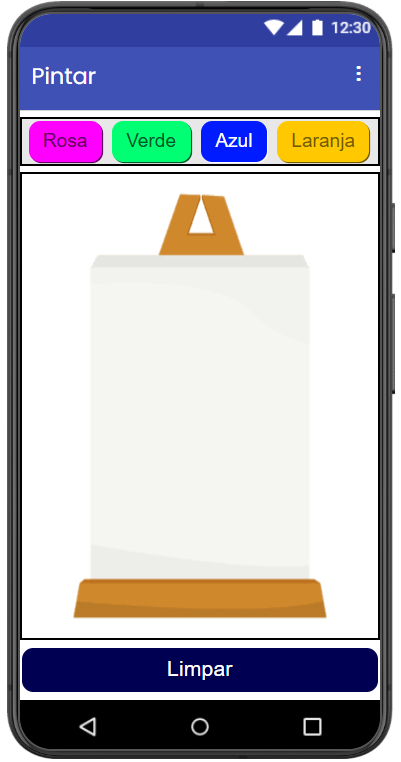 | 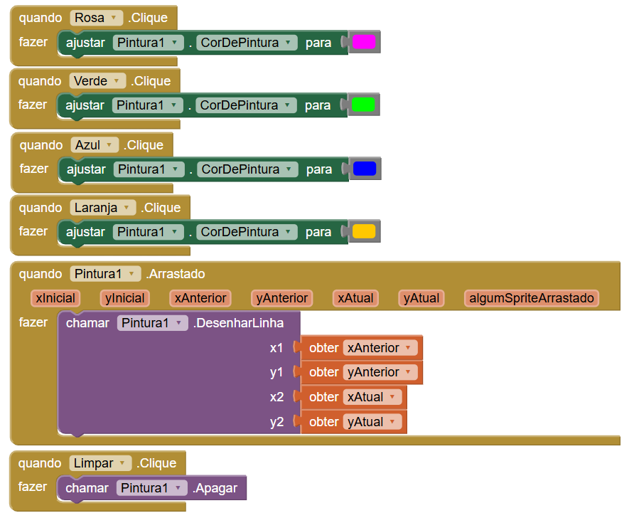 |

---

# Projeto 3 – Terceiro Aplicativo (pg. 56)

## Descrição
**Objetivo:**   
O aplicativo tem como objetivo demonstrar a utilização de recursos multimídia em dispositivos móveis, integrando som e vibração para criar uma interação mais dinâmica com o usuário. Ele busca exemplificar, de forma prática, como eventos de clique podem acionar diferentes funcionalidades do aparelho, tornando a experiência mais realista e interativa.

**Funcionamento:**   
O funcionamento do aplicativo ocorre a partir do clique em cima da imagem apresentada na tela.. Ao ser apetado, o sistema aciona simultaneamente a reprodução de um som e a vibração do dispositivo por um determinado período de tempo. Dessa forma, o usuário percebe uma resposta imediata tanto auditiva quanto sensorial, simulando o funcionamento de um objeto real, como um liquidificador.

**Modificações feitas diante da apostila:**   
Com base no modelo apresentado na apostila, foram realizadas algumas modificações na interface do aplicativo com o objetivo de torná-la mais personalizada e visualmente mais atrativa. A imagem original foi substituída por outra mais adequada ao contexto proposto. Além disso, o som utilizado também foi alterado, proporcionando uma experiência mais coerente com a proposta do aplicativo.

## Print da tela do Design
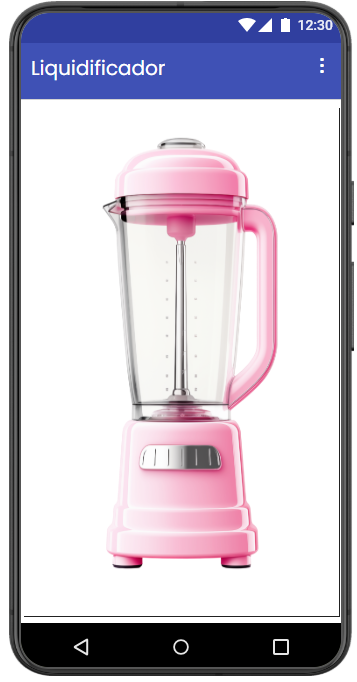

## Print da tela dos Blocos
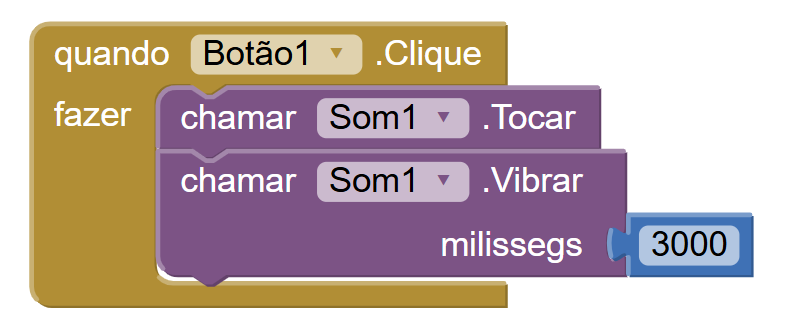

---

# Projeto 4 – Quarto Aplicativo (pg. 64)

## Descrição
**Objetivo:**   
O aplicativo tem como objetivo demonstrar o uso da câmera do dispositivo móvel, permitindo capturar imagens e exibi-las diretamente na tela. Ele foi desenvolvido para exemplificar a integração entre o aplicativo e os recursos do aparelho, facilitando o entendimento sobre como utilizar componentes nativos em aplicações.

**Funcionamento:**   
O funcionamento do aplicativo baseia-se na interação com dois botões principais. Ao clicar no botão “Tirar Foto”, o aplicativo aciona a câmera do dispositivo, permitindo ao usuário capturar uma imagem. Após o registro, a foto tirada é automaticamente exibida na tela do aplicativo. Já o botão “Fechar” tem a função de encerrar a tela atual, finalizando a utilização do aplicativo.

**Modificações feitas diante da apostila:**   
Com base no modelo apresentado na apostila, foram realizadas algumas modificações na interface do aplicativo com o objetivo de torná-la mais personalizada e visualmente mais atrativa. Houve alteração na fonte utilizada, tornando o texto mais agradável visualmente. A cor dos botões foi modificada para um tom de rosa bebê, além de terem sido ajustados com bordas arredondadas. Também foi realizado o aumento do tamanho da fonte, proporcionando melhor leitura e acessibilidade ao usuário.

## Print da tela do Design
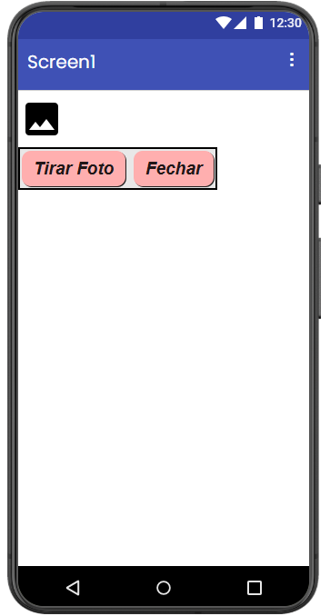

## Print da tela dos Blocos
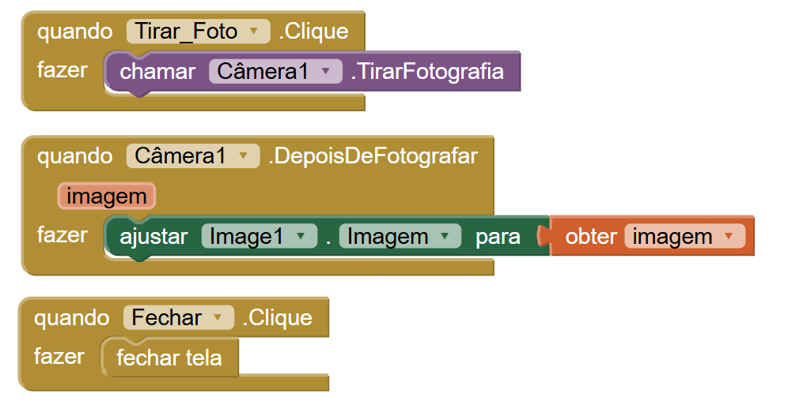

---

# Projeto 5 – Quinto Aplicativo (pg. 69)

## Descrição
**Objetivo:**   
O aplicativo tem como objetivo apresentar a navegação entre diferentes telas dentro de um sistema mobile, permitindo ao usuário acessar conteúdos distintos de forma organizada. Ele busca demonstrar como estruturar um aplicativo com múltiplas interfaces, tornando a experiência mais completa e interativa.

**Funcionamento:**   
O funcionamento do aplicativo ocorre por meio de botões que direcionam o usuário para diferentes telas. Na tela inicial, é possível selecionar entre duas opções, que levam a conteúdos distintos. Ao clicar em cada botão, o aplicativo abre uma nova tela correspondente, exibindo imagens específicas. Além disso, cada tela possui opções para retornar à tela inicial, permitindo uma navegação simples, organizada e intuitiva entre as diferentes seções do aplicativo.

**Modificações feitas diante da apostila:**   
Com base no modelo apresentado na apostila, foram realizadas algumas modificações na interface do aplicativo com o objetivo de torná-la mais personalizada e visualmente mais atrativa. As imagens de fundo das três telas foram modificadas, trazendo uma identidade visual mais personalizada. Os botões também passaram por ajustes, recebendo bordas arredondadas e novas cores. Além disso, a cor da barra da tela inicial foi alterada, contribuindo para um design mais harmonioso.

## Print das telas do Design
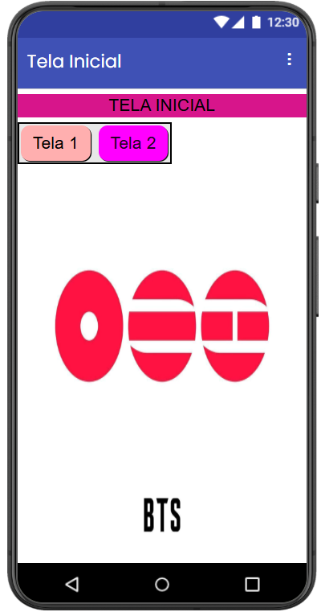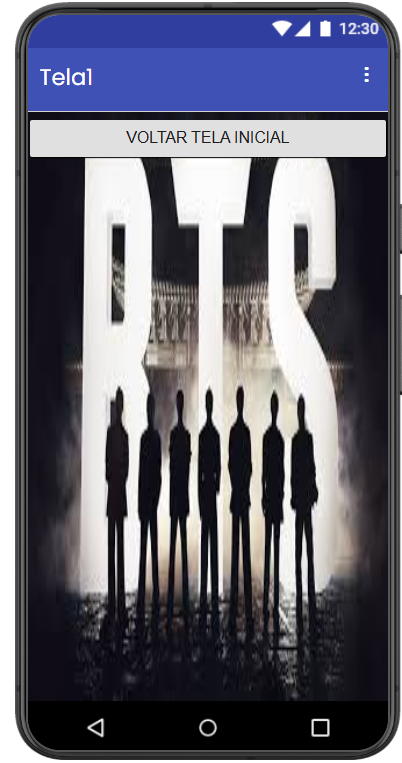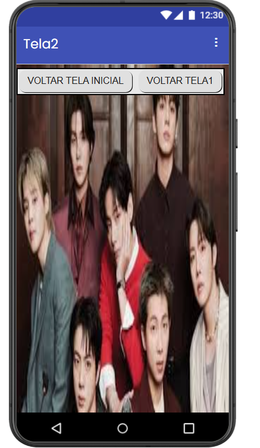

## Print da tela dos Blocos
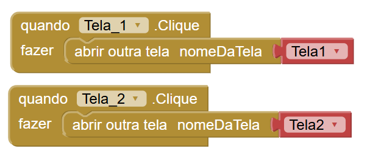

---

# Projeto 6 – Sexto Aplicativo (pg. 82)

## Descrição
**Objetivo:**   
O aplicativo tem como objetivo demonstrar a manipulação de entrada de dados do usuário, permitindo a personalização de mensagens exibidas na tela. Ele foi desenvolvido para exemplificar como capturar informações digitadas e utilizá-las de forma dinâmica dentro do aplicativo.

**Funcionamento:**   
O funcionamento do aplicativo baseia-se na interação com uma caixa de texto e um botão. O usuário pode digitar qualquer conteúdo na área indicada e, ao pressionar o botão, o aplicativo combina esse texto com uma mensagem pré-definida, exibindo o resultado em uma legenda na tela. Dessa forma, o sistema responde diretamente à entrada do usuário, demonstrando na prática como ocorre a manipulação de dados em aplicações móveis.

**Modificações feitas diante da apostila:**   
Com base no modelo apresentado na apostila, foram realizadas algumas modificações na interface do aplicativo com o objetivo de torná-la mais personalizada e visualmente mais atrativa. A cor de fundo do botão foi modificada, tornando-o mais destacado na tela. Também foram ajustados o texto do botão e a mensagem exibida ao usuário, deixando o aplicativo mais personalizado e alinhado com a proposta visual adotada.

## Print das telas do Design
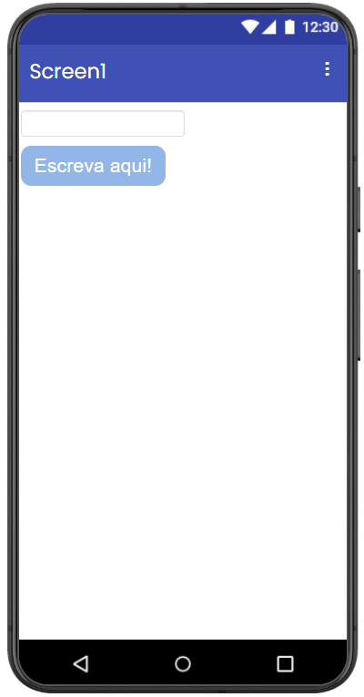

## Print da tela dos Blocos
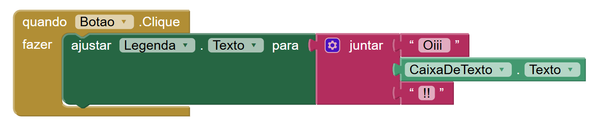
