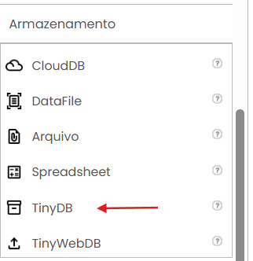

# App Inventor: Manipulação de Banco de Dados no Dispositivo (TinyDB)

**`Instituição:`**
ETEC Vasco Antônio Venchiarutti

**`Curso:`**
Informática para Internet

**`Turma:`**
2º ano D

**`Autores:`**
- [Alice Gimenez Siqueira](https://github.com/alice-gimenez)
- [Alice Rasmussen Rezende Alves](https://github.com/alicerez0703)
- [Amanda Neves Oliveira](https://github.com/amandanevoli)
- [Ana Lívia Takeyama Romanato](https://github.com/liviatakeyama)
- [Isabelli Dias da Silva](https://github.com/isabelbelli)

---

## 1. O que é o MIT App Inventor?

O **MIT App Inventor** é uma plataforma de desenvolvimento web de código aberto mantida pelo Massachusetts Institute of Technology (MIT). Ele permite a criação de aplicativos para dispositivos Android e iOS utilizando uma abordagem visual baseada em blocos de arrastar e soltar, eliminando a necessidade de digitar códigos em linguagens complexas como Java, Kotlin ou Swift.

**Para que é utilizado:**   

O ecossistema é amplamente utilizado no ensino de programação, prototipagem rápida de projetos e introdução à lógica de desenvolvimento de software. Ele serve como uma excelente porta de entrada para que estudantes e entusiastas transformem ideias em aplicativos funcionais de forma ágil.

**Principais vantagens para iniciantes:**   

- **Programação Visual:** Substitui a sintaxe textual por blocos lógicos interconectáveis, o que reduz drasticamente os erros de digitação (erros de sintaxe).

- **Ambiente Nuvem:** Não exige a instalação de ambientes de desenvolvimento complexos (IDEs) no computador; tudo roda diretamente no navegador.

- **Testes em Tempo Real:** Através do aplicativo MIT AI2 Companion, é possível visualizar as alterações feitas no projeto instantaneamente no smartphone via Wi-Fi.

## 2. O que é o TinyDB?

O **TinyDB** é um componente não visível do MIT App Inventor que pertence à categoria de armazenamento de dados (Storage).

| Passo | Imagem |
|---|---|
| *1.* Nos componentes durante a criação do app, clique em "Armazenamento". O componente "TinyDB" estará lá. | |
| *2.* Arraste esse componente para a tela do celular. Ele aparecerá logo abaixo da tela como um item invisível. |  |

**Finalidade e Local de Armazenamento:**   

Sua finalidade principal é permitir a persistência de dados local. Isso significa que as informações salvas pelo usuário não são perdidas quando o aplicativo é fechado ou quando o dispositivo é reiniciado. Os dados são armazenados diretamente na memória interna do próprio dispositivo (smartphone ou tablet), no espaço reservado exclusivamente para aquele aplicativo.

**Vantagens e Limitações:**   

| Vantagens | Limitações |
|---|---|
| **Simplicidade:** Fácil implementação sem necessidade de comandos SQL. | **Escopo Local:** Os dados não podem ser compartilhados entre dispositivos diferentes. |
| **Independência de Internet:** Funciona totalmente offline. | **Segurança Baixa:** Não possui criptografia nativa avançada para dados ultrassensíveis. |
| **Velocidade:** Acesso quase instantâneo por ler arquivos da memória local. | **Volume de Dados:** Inadequado para gerenciar tabelas gigantescas ou relacionamentos complexos. |

## 3. Funcionamento do TinyDB

O funcionamento do TinyDB baseia-se no conceito de armazenamento de dados do tipo Chave-Valor. No ambiente do App Inventor, a chave é denominada **Tag**, que consiste em uma string de texto atuando como um identificador exclusivo para localizar uma informação. O **Valor**, por sua vez, representa o conteúdo armazenado sob aquela etiqueta específica, podendo abranger desde textos simples e números até listas completas de informações.

O ciclo de manipulação desses dados ocorre de maneira direta. O processo de gravação associa um valor a uma tag específica; caso a tag informada ainda não exista no sistema, o componente se encarrega de criá-la automaticamente. Para realizar a leitura, o desenvolvedor solicita o conteúdo de uma tag desejada, sendo obrigatório definir um valor padrão de retorno para os casos em que a tag consultada nunca tenha sido criada anteriormente.

A atualização dos dados acontece por meio da sobreposição: ao realizar uma nova gravação utilizando uma tag já existente, o TinyDB substitui o registro antigo pelo atual de forma imediata. Por fim, a remoção consiste na exclusão definitiva da tag e de seu respectivo valor, liberando o espaço ocupado na memória interna do dispositivo.

**Exemplo Prático de Fluxo:**   

Imagine a criação de um jogo onde salvamos o recorde do jogador. A tag configurada será ```"MaiorPontuacao"``` e o valor inicial gravado será ```1500```. Quando o jogador superar essa marca atingindo ```1800``` pontos, o aplicativo dispara uma nova gravação sob a mesma tag ```"MaiorPontuacao"```, agora com o valor ```1800```. O banco de dados automaticamente descarta o número antigo e passa a retornar o novo recorde nas próximas leituras.

## 4. Componentes Relacionados (Blocos)

Para interagir com o TinyDB, utilizamos blocos específicos dentro do editor de lógica do App Inventor.

```StoreValue (tag, valueToStore)```:

- **Quando utilizar:** Sempre que precisar salvar ou atualizar uma informação.
- **Exemplo:** Guardar o nome digitado em uma caixa de texto ao clicar no botão "Salvar".

```GetValue (tag, valueIfTagNotThere)```:

- **Quando utilizar:** Na inicialização da tela ou quando precisar exibir o dado salvo. Requer a definição de um valor de retorno caso a tag esteja vazia.

- **Exemplo:** Buscar a configuração de "Tema Escuro" (Verdadeiro/Falso). Se a tag não existir, define como Falso.