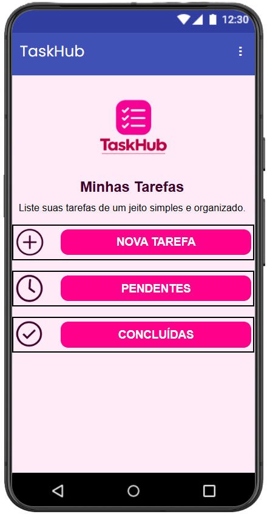
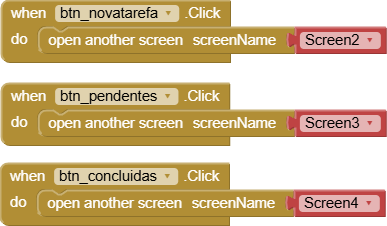
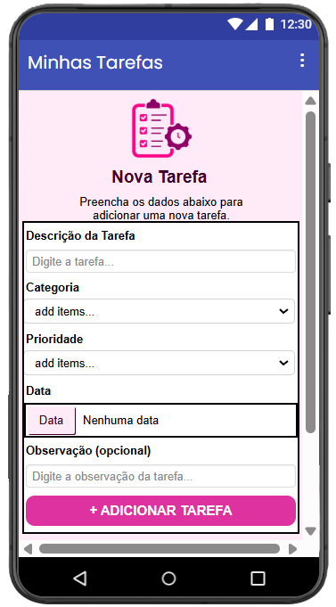
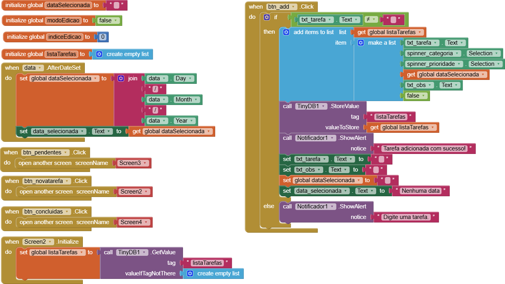
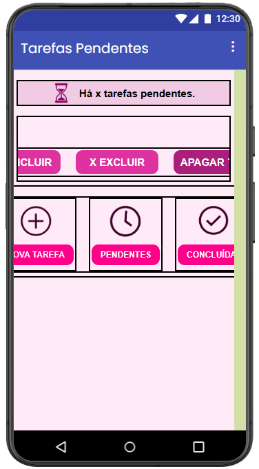
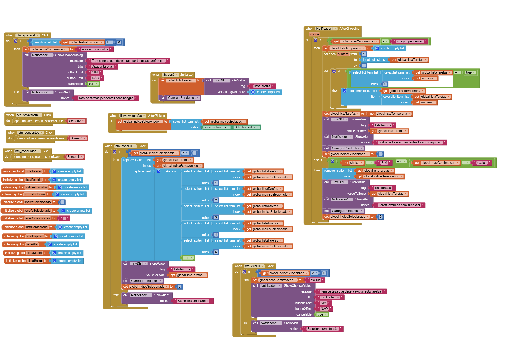
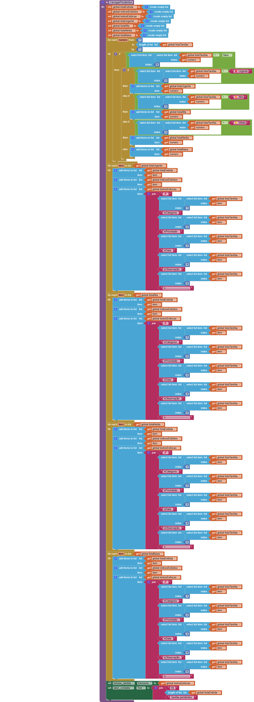
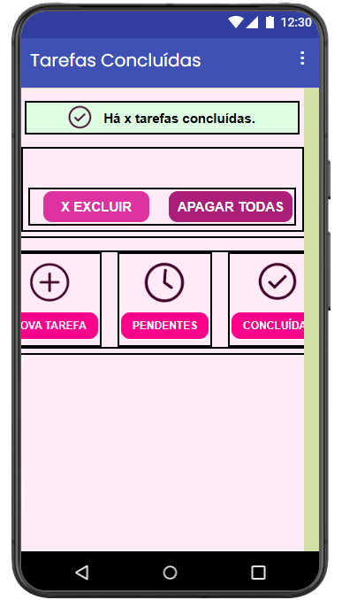
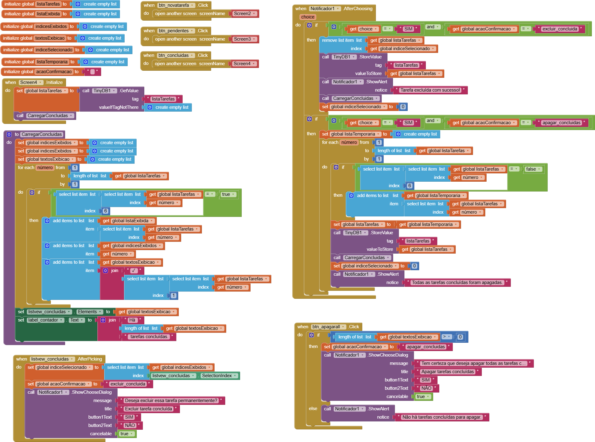

# App Inventor: Aplicativo de Lista de Tarefas com TinyDB

**`Instituição:`**
ETEC Vasco Antônio Venchiarutti

**`Curso:`**
Informática para Internet

**`Turma:`**
2º ano D

**`Autores:`**
- [Alice Gimenez Siqueira](https://github.com/alice-gimenez)
- [Alice Rasmussen Rezende Alves](https://github.com/alicerez0703)
- [Amanda Neves Oliveira](https://github.com/amandanevoli)
- [Ana Lívia Takeyama Romanato](https://github.com/liviatakeyama)
- [Isabelli Dias da Silva](https://github.com/isabelbelli)

---

# 📱 TaskHub

---

## Descrição 

O aplicativo desenvolvido no MIT App Inventor é um gerenciador de tarefas criado para auxiliar o usuário na organização de suas atividades diárias. A proposta é reunir, em um único aplicativo, as tarefas que precisam ser realizadas, permitindo que o usuário registre informações importantes sobre cada uma delas e acompanhe seu andamento. Ao cadastrar uma tarefa, é possível informar seu nome, categoria, nível de prioridade, data e observações, tornando o controle das atividades mais detalhado e organizado.

O aplicativo foi pensado para ser simples de utilizar e facilitar a rotina do usuário. As tarefas são organizadas de acordo com seu estado, podendo ser visualizadas como pendentes ou concluídas. Dessa forma, o usuário consegue acompanhar o que ainda precisa fazer e também visualizar as atividades que já foram realizadas.

### 🎯 Objetivo

O principal objetivo do aplicativo é facilitar a organização e o gerenciamento de tarefas, ajudando o usuário a controlar melhor suas atividades e compromissos. 

A utilização de diferentes níveis de prioridade, como urgente, alta, média e baixa, permite que o usuário identifique rapidamente quais atividades precisam ser realizadas primeiro. Além disso, a possibilidade de adicionar uma data e observações ajuda a manter informações importantes relacionadas à tarefa no próprio aplicativo, evitando a necessidade de utilizar outros meios para fazer essas anotações.

Outro objetivo do projeto é aplicar conhecimentos de lógica de programação e desenvolvimento de aplicativos, utilizando os recursos disponíveis no MIT App Inventor para transformar uma ideia em uma aplicação funcional.

### ⚙️ Funcionamento

O aplicativo possui diferentes telas responsáveis por funções específicas, evitando que todas as informações e ações fiquem concentradas em uma única tela. Na tela de cadastro, o usuário pode inserir uma nova tarefa e preencher seus principais dados, como nome, categoria, prioridade, data e observações. Depois que a tarefa é cadastrada, ela é adicionada à lista e fica disponível na área de tarefas pendentes.

Na tela de tarefas pendentes, as atividades são organizadas de acordo com sua prioridade, permitindo uma visualização mais prática. O usuário pode selecionar uma tarefa e marcá-la como concluída. Quando isso acontece, a tarefa deixa de fazer parte das pendentes e passa a aparecer na tela de tarefas concluídas. Também existem opções para excluir tarefas individualmente, sempre apresentando uma mensagem de confirmação antes da exclusão.

Além disso, o aplicativo possui funções para apagar todas as tarefas pendentes ou todas as tarefas concluídas de uma só vez. Antes de realizar essas ações, o sistema solicita uma confirmação ao usuário, evitando que informações sejam apagadas por engano.

### 💾 Desenvolvimento

O aplicativo foi desenvolvido utilizando a programação por blocos do MIT App Inventor, permitindo trabalhar diferentes conceitos de lógica de programação. Durante a construção foram utilizadas variáveis globais, listas, estruturas condicionais, estruturas de repetição, eventos de clique e procedimentos, responsáveis por organizar e controlar o funcionamento das diferentes partes do aplicativo.

Para armazenar as informações das tarefas foi utilizado o componente ***TinyDB***. Ele permite salvar a lista de tarefas no dispositivo, fazendo com que os dados permaneçam armazenados mesmo quando o aplicativo é fechado. Quando uma tela é aberta novamente, o aplicativo recupera essas informações e atualiza as listas para mostrar os dados salvos.

Cada tarefa possui várias informações armazenadas em uma lista, como o nome da atividade, categoria, prioridade, data, observação e seu estado de conclusão. A partir desses dados, o aplicativo consegue separar as tarefas pendentes das concluídas e organizá-las de acordo com a prioridade escolhida pelo usuário.

### 💡 Finalidade do projeto

Além de apresentar uma solução para a organização de atividades, o projeto teve como finalidade colocar em prática os conhecimentos adquiridos durante o curso, principalmente relacionados à lógica de programação e ao desenvolvimento de aplicações. A criação do aplicativo permitiu compreender melhor como diferentes elementos de programação podem trabalhar juntos para realizar ações de acordo com o que o usuário faz dentro da aplicação.

O projeto também possibilitou trabalhar com armazenamento de dados, manipulação de listas, condições e repetições, além da criação de uma interface com diferentes telas e funções. Dessa forma, o aplicativo não serve apenas como uma ferramenta de organização, mas também demonstra na prática o processo de desenvolvimento de uma aplicação funcional, desde a entrada das informações pelo usuário até o armazenamento, processamento e exibição dos dados.

## Print das Telas do Design e dos Blocos

| Print da tela do Design | Print da tela dos Blocos | Print da tela dos Blocos |
|------|------|-----|
|  |  |
|  |  |
|  |  |  |
|  |  |

